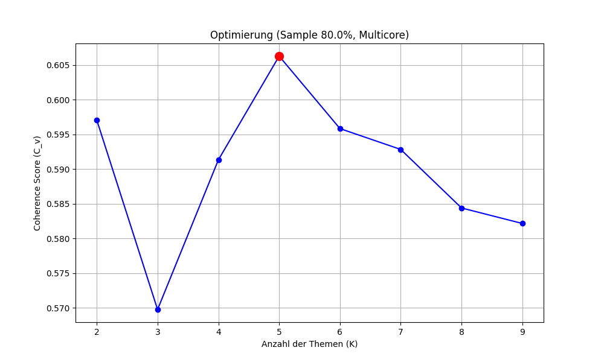

# Consumer Complaints Analysis

Dieses Repository enthält die Codebasis für das Portfolio im Bereich Data Science / Data Analysis. 
Ziel des Projekts ist der Vergleich verschiedener NLP-Verfahren zur Vektorisierung und Themenmodellierung sowie die Entwicklung einer optimierten Pipeline zur Verarbeitung unstrukturierter Textdaten aus dem "Consumer Complaints" Datensatz.
Dabei sollen automatisch die Hauptbeschwerdegründe der enthaltenen Kundenbeschwerden identifiziert werden.

## Projektübersicht

Das Projekt vergleicht verschiedene Vektorisierungs- und Modellierungsansätze, um eine robuste Pipeline für Kurztexte zu entwickeln:

* **Datenbasis:** Consumer Complaints Dataset (Finanzbeschwerden)
* **Vektorisierung:** Vergleich von **TF-IDF** (statistisch), **Bag-of-Words** (statistisch) und **Word2Vec** (semantisch)
* **Topic Modeling:** Vergleich von **Non-negative Matrix Factorization (NMF)**, **Latent Dirichlet Allocation (LDA)** und **K-Means**

## Ergebnisse

Für die Reproduzierbarkeit wurde ein Seed (`random_state=42`) eingefügt, um sicherzustellen, dass bei der Anwendung von Stichproben (Samples) immer die gleichen Daten geladen werden. Die Analyse der drei Pipelines lieferte bemerkenswerte Erkenntnisse über die Verhaltensweisen der Algorithmen:

<details>
<summary><strong>Coherence Score</strong></summary>



</details>

<details>
<summary><strong>Kmeans</strong></summary>

K-Means zeigte eine starke Abhängigkeit von irrelevanter Semantik und erzeugte kaum nutzbare Themen. Die Cluster bestanden teils aus Tippfehlern, stark emotionalen Adjektiven oder unzusammenhängenden Objekten:

*   **Thema 1 (Tippfehler & Parsing-Artefakte):** inqiured, garavans, accondance, fromfinance, theymay, thansevenyears, lkm, creditinquired, accodace, tacct
*   **Thema 2 (Alltagsobjekte & Physische Umgebung):** cigarette, sidewalk, elevator, rail, cook, drinking, outdoor, backyard, camp, tent
*   **Thema 3 (Extreme Emotionen & Wertungen):** sickening, intolerable, terrifying, brutal, perceive, distasteful, heartbreaking, smack, astonishing, psychologically
*   **Thema 4 (Darlehensanpassungen & Kalkulationen):** buydown, reamortized, adjusts, recalculating, skyrocketed, readjusted, estimating, ballooning, budgeted, prepaying
*   **Thema 5 (Juristisches Vokabular):** declares, recordation, tribunal, privity, enforceability, frbp, affirms, embodied, irrespective, conferred

</details>

<details>
<summary><strong>LDA (Latent Dirichlet Allocation)</strong></summary>

LDA lieferte inhaltlich wesentlich passendere finanzielle Ansätze als K-Means, litt aber spürbar unter thematischem Rauschen. Zwar sind die übergeordneten Beschwerdegründe erkennbar, jedoch vermischen sich die Cluster stark mit generischen Füll- und Kommunikationswörtern (wie `would`, `time`, `called`, `told`), was eine klare Abgrenzung erschwert:

*   **Thema 1 (Kreditzahlungen & Hypotheken):** payment, loan, mortgage, would, time, paid, month, late, year, pay
*   **Thema 2 (Verbraucherrechte & Gesetzgebung):** consumer, section, reporting, account, usc, information, right, agency, state, credit
*   **Thema 3 (Inkasso & Forderungsmanagement):** debt, collection, company, information, law, claim, request, notice, letter, provide
*   **Thema 4 (Bankkonten & Kundenservice):** account, bank, card, would, call, told, called, money, time, credit
*   **Thema 5 (Kreditberichte & Bonitätsprüfung):** credit, report, account, information, reporting, inquiry, bureau, please, date, item

</details>

<details>
<summary><strong>NMF (Non-Negative Matrix Factorization) - Gewinner-Pipeline</strong></summary>

Die Kombination aus TF-IDF und NMF erwies sich als der mit Abstand robusteste und effizienteste Ansatz. 
NMF konnte das thematische Rauschen (Füllwörter) von LDA und die semantischen Irrwege (Tippfehler, Emotionen) von K-Means nahezu vollständig eliminieren. 
Die resultierenden Cluster sind extrem trennscharf und spiegeln exakt die realen Beschwerdekategorien wider:

*   **Thema 1 (Identitätsdiebstahl & Credit Reporting):** credit, report, information, account, item, inquiry, reporting, bureau, identity, theft
*   **Thema 2 (Verbraucherrechte & Gesetzgebung):** section, usc, consumer, state, right, reporting, privacy, agency, furnish, account
*   **Thema 3 (Bankkonten & Transaktionen):** account, bank, card, money, told, called, would, number, call, check
*   **Thema 4 (Inkasso & Schulden):** debt, collection, company, letter, validation, collect, owe, collector, sent, original
*   **Thema 5 (Kredite & Hypotheken):** payment, loan, late, mortgage, month, paid, due, time, interest, pay

</details>


## Projektstruktur

Das Projekt folgt Best Practices für Data-Science-Architekturen. 
Code und Daten sind strikt getrennt:

```text
Project-Data-Analysis/
├── data_analyse.py       # Interaktives Hauptmenü (GUI/CLI) für einfache Bedienung
├── assets/               # Statische Dateien (z. B. Icons, Logos, Bilder für GUI oder Doku)
├── data/                 # Rohdaten, bereinigte Daten, Modelle & Grafiken (Git-ignoriert)
├── src/                  # Die modularen Skripte der Daten-Pipeline (Phase 1 bis 5)
├── requirements.txt      # Python-Abhängigkeiten
└── README.md             # Projektdokumentation
```

## Installation

Dieses Projekt wurde mit **Python 3.11.9** entwickelt. 
Um Kompatibilitätsprobleme zu vermeiden, wird die Verwendung von Linux in Kombination mit `pyenv` zur Verwaltung der Python-Version empfohlen.

1. **Virtuelle Umgebung installieren (empfohlen)**

    Falls `pyenv` noch nicht installiert ist, folge bitte einer der beiden Anleitungen für Windows oder Linux:

    <details>
    <summary><strong>Linux</strong></summary>

    Damit `pyenv` später Python aus dem Quellcode kompilieren kann, müssen zuerst die System-Abhängigkeiten installiert werden.

    **Abhängigkeiten installieren:**

    ```bash
    sudo apt update && sudo apt install -y make build-essential libssl-dev zlib1g-dev libbz2-dev libreadline-dev libsqlite3-dev wget curl llvm libncurses5-dev xz-utils tk-dev libffi-dev liblzma-dev git
    curl https://pyenv.run | bash
    echo 'export PYENV_ROOT="$HOME/.pyenv"' >> ~/.bashrc
    echo 'command -v pyenv >/dev/null || export PATH="$PYENV_ROOT/bin:$PATH"' >> ~/.bashrc
    echo 'eval "$(pyenv init -)"' >> ~/.bashrc
    source ~/.bashrc
    ```

    </details>

    <details>
    <summary><strong>Windows</strong></summary>

    Das offizielle Paket "Microsoft Visual C++ Redistributable" sollte auf dem System installiert sein.
    Es kann hier heruntergeladen werden: https://learn.microsoft.com/en-us/cpp/windows/latest-supported-vc-redist?view=msvc-170
    Pyenv kann anschließend mit folgendem Befehl installiert werden:

    ```powershell
    Set-ExecutionPolicy -ExecutionPolicy RemoteSigned -Scope CurrentUser # Erlaubt die Ausführung externe Skripte
    iex "& { $(irm https://raw.githubusercontent.com/pyenv-win/pyenv-win/master/pyenv-win/install-pyenv-win.ps1) }" # Installiert Pyenv
    ```

    Anschließend müssen die Systemvariablen gesetzt werden:

    ```powershell
    [System.Environment]::SetEnvironmentVariable('PYENV', "$env:USERPROFILE\.pyenv\pyenv-win\", 'User')
    [System.Environment]::SetEnvironmentVariable('PYENV_ROOT', "$env:USERPROFILE\.pyenv\pyenv-win\", 'User')
    [System.Environment]::SetEnvironmentVariable('Path', "$env:USERPROFILE\.pyenv\pyenv-win\bin;$env:USERPROFILE\.pyenv\pyenv-win\shims;" + [System.Environment]    ::GetEnvironmentVariable('Path', 'User'), 'User')
    ```

    Hier benötigt die Powershell einen Neustart.
    Danach kann mit Schritt 2 weiter verfahren werden.

    </details>

2. **Repository klonen:**

    ```bash
    git clone https://github.com/StaticFrost-No1/Project-Data-Analysis.git
    cd Project-Data-Analysis
    ```

3. **Python 3.11.9 installieren**

    ```bash
    pyenv install 3.11.9
    pyenv local 3.11.9
    ```

4. **Virtuelle Umgebung erstellen und aktivieren (empfohlen):**

    ```bash
    pyenv exec python -m venv .venv
    source .venv/bin/activate
    ```

5. **Abhängigkeiten installieren:**

    ```bash
    pip install -r requirements.txt
    ```

## Nutzung 

Der Code wurde modular in fünf Phasen unterteilt. 
Du kannst das gesamte Projekt entweder bequem über das Hauptmenü steuern oder die Skripte einzeln ausführen.


### Option A: Das interaktive Hauptmenü (Empfohlen)

Starte das zentrale Interface im Hauptverzeichnis. Es führt dich interaktiv durch alle Schritte der Pipeline:

<details>
<summary><strong>Linux</strong></summary>

```bash
python data_analyse.py
```

Folge den Bildschirmanweisungen, um pyenv zur Shell hinzuzufügen.

</details>

### Option B: Manuelle Ausführung der Pipeline

Alternativ können die Skripte im src/-Ordner nacheinander ausgeführt werden. 
Die Ergebnisse der jeweiligen Skripte, wie Pickle-Dateien und Modelle, werden automatisch im data/-Ordner gespeichert.

1.  **Phase 1 & 2: Datenbeschaffung und Bereinigung**
    - `python src/1_Preparation.py` (Laden der Rohdaten)
    - `python src/2_Preprocessing.py` (Textbereinigung; inkl. interaktiver Abfrage der gewünschten Zeilenanzahl)

2.  **Phase 3: Vektorisierung**
    - `python src/3a_Vectorization_TFIDF.py` (Für NMF)
    - `python src/3b_Vectorization_BoW.py` (Für LDA)
    - `python src/3c_Vectorization_W2V.py` (Für K-Means)

3.  **Phase 4: Hyperparameter-Optimierung**
    - `python src/4_Coherence_Score.py` (Berechnet den optimalen K-Wert mittels LDA auf einem Teildatensatz)

4.  **Phase 5: Topic Modeling (Vergleich)**
    - `python src/5a_Topic_Modeling_NMF.py`
    - `python src/5b_Topic_Modeling_LDA.py`
    - `python src/5c_Topic_Modeling_KMeans.py`

## Wichtige Parameter

Einige Phasen (insbesondere 4 und 5) sind extrem rechenintensiv. Die Konfigurationsblöcke am Anfang der jeweiligen Skripte ermöglichen eine Anpassung an die vorhandene Hardware:

* **SAMPLE_FRAC (in Skript 4):** Passt die Größe des verarbeiteten Teildatensatzes zur Ermittlung der Themenanzahl an (z. B. `0.20` = 20 % der Daten). Ein Wert von `0.60` hat sich als ideal erwiesen, um Abstürze durch die Limitierung des Arbeitsspeichers zu vermeiden, die Rechenzeit im Rahmen zu halten und präzise Ergebnisse zu erhalten.
* **NUM_TOPICS (in Skript 5a, 5b, 5c):** Die Anzahl der zu suchenden Themen. Dieser Wert sollte idealerweise dem Ergebnis aus Phase 4 entsprechen und wurde daher auf den Wert `5` gesetzt.
* **WORDS_PER_TOPIC (in Skript 5a, 5b, 5c):** Legt fest, wie viele Schlüsselwörter pro Thema ausgegeben werden (Standard: 10).
* **PASSES (in Skript 4 & 5b):** Relevanter Parameter für LDA. Bestimmt die Anzahl der Trainingsdurchläufe. In Phase 4 reicht ein niedriger Wert (`2`), um Trends zu erkennen. Für das finale Modell in Phase 5b wird ein höherer Wert (z. B. `10`) empfohlen.
* **WORKERS (in Skript 4 & 5b):** Zahl der verwendeten CPU-Kerne für LDA. Mehr Kerne beschleunigen den Prozess, benötigen aber drastisch mehr Arbeitsspeicher.

## Lizenz

Dieses Projekt ist unter der [MIT License](LICENSE) lizenziert.